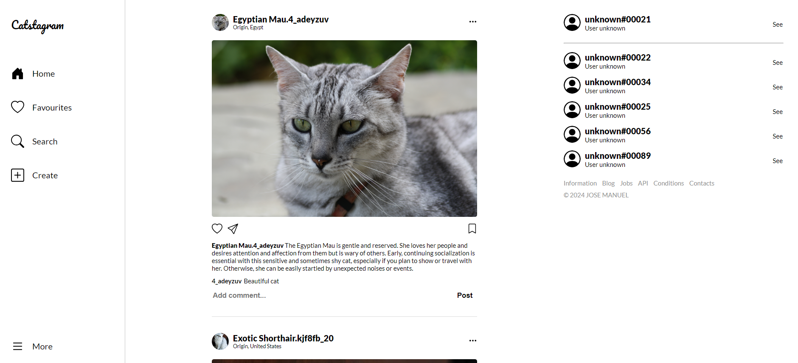
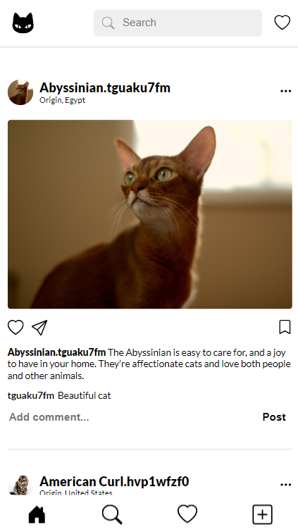

# Catstagram

Project to obtain the Svelte course certificate on platzi. [`Deployed in`](https://github.com/josema357/catstagram).

## UI - Desktop



## UI - Mobile



## Building

To create a production version of your app:

```bash
npm run build
```

You can preview the production build with `npm run preview`.

> To deploy your app, you may need to install an [adapter](https://kit.svelte.dev/docs/adapters) for your target environment.
